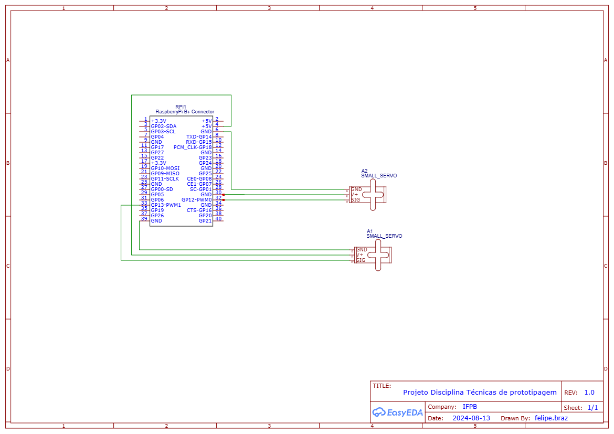

# Projeto_Eco

Este projeto tem como objetivo a contrução de uma PoC(Proof of Concept) que consiste em dispositivo composto por um fliperama, integrado com visão computacional para identificação de diferentes tipos de materiais recicláveis e realização da separação adequada visando contribuir para o processo de conscientização sobre a importância da coleta seletiva para o meio ambiente.

## Link para download da rede neural convolucional treinada
https://drive.google.com/file/d/1GrA95scyMCh0uJhb7LIp1W_FM5i6ENZy/view?usp=sharing

# Tecnologias 💻

Este projeto foi desenvolvido com as seguintes tecnologias 

- [python] (https://www.python.org/)
   - Versão : 3.9
  - Requer a versão do pip igual ou acima da 20.3.4
  ~~~python
  $ python -m pip install pip==20.3.4
  ~~~~
#### Bibliotecas utilizadas 
- [OpenCV] (https://opencv.org/)
  - Requer a biblioteca cv2 para a visão computacional
  ~~~ python 
  $ python pip install cv2=4.9.0  
  ~~~
  
- [Keras] (https://keras.io/)
  - Para instalar a bibliotecas keras 
  ~~~ python  
  $ python pip install tensorflow=2.17.0
  ~~~
- [TensorFlow] (https://www.tensorflow.org/?hl=pt-br)  
  - Para instalar a bibliotecas tensorflow
  ~~~ python  
  $ python pip install tensorflow=2.17.0
  ~~~

- [Numpy] (https://numpy.org/)
  - Para instalar a bibliotecas keras no terminal
  ~~~ python 
  $ python pip install numpy=1.26.4
  ~~~~

- [Pygame] (https://www.pygame.org/docs/)
  - Para instalar a bibliotecas pygame  
  ~~~ python 
  $ python pip install pygame=1.9.6
  ~~~

## Arquitetura do projeto

## Diagrama de blocos 

## Máquina de estados

## Diagrama Elétrico

## Prototipo Futuro para o fliperama
https://www.figma.com/design/0f0Bag1AlzG2uF1EPTE9In/Ecorama?node-id=1-2&m=dev&t=lQoj1Hq8c9NTdhzq-1
## Autores
- [Felipe Braz](https://github.com/felipebrazfb333)
- [Pedro Wilson](https://github.com/Pwsouza)

